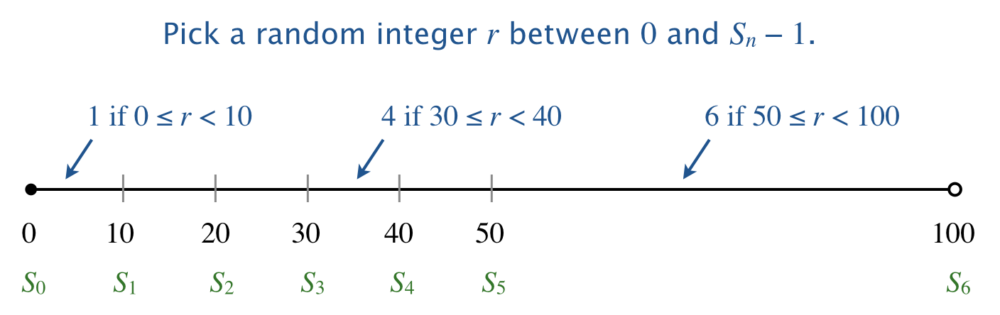

# Discrete Distribution Sampler

This Java program generates random indices according to a discrete probability distribution, where each index's selection probability is proportional to its given weight.

## About Discrete Distribution Sampling

The program demonstrates how to:
- Sample from a discrete probability distribution
- Use cumulative sums for efficient weighted random selection
- Generate indices with probabilities proportional to given weights

## Program Usage

Compile and run the program with:
```bash
javac DiscreteDistribution.java
java DiscreteDistribution m a1 a2 ... an
```

Where:
- `m` = number of random indices to generate
- `a1, a2, ..., an` = sequence of positive integer weights

## Example Outputs

### Uniform Distribution (equal weights)
```bash
~/Desktop/arrays> java DiscreteDistribution 25 1 1 1 1 1 1
5 2 4 4 5 5 4 3 4 3 1 5 2 4 2 6 1 3 6 2 3 2 4 1 4
```

### Weighted Distribution (one dominant weight)
```bash
~/Desktop/arrays> java DiscreteDistribution 25 10 10 10 10 10 50
3 6 6 1 6 6 2 4 6 6 3 6 6 6 6 4 5 6 2 2 6 6 2 6 2
```

### Binary Distribution (two weights)
```bash
~/Desktop/arrays> java DiscreteDistribution 25 80 20
1 2 1 2 1 1 2 1 1 1 1 1 1 1 1 2 2 2 1 1 1 1 1 1 1
```

### Complex Distribution (multiple weights)
```bash
~/Desktop/arrays> java DiscreteDistribution 100 301 176 125 97 79 67 58 51 46
6 2 4 3 2 3 3 1 7 1 1 3 4 7 1 4 2 2 1 1 3 1 8 6 2 
1 3 6 1 8 5 1 3 6 1 1 2 3 8 7 4 6 4 3 1 5 3 3 7 3 
1 3 1 7 7 2 2 3 6 5 4 1 1 1 7 2 3 5 2 2 1 4 1 2 1 
2 1 2 2 3 2 8 4 3 2 1 8 3 5 3 3 8 1 2 3 3 1 2 3 1
```

## Visual Explanation




The diagram shows how cumulative sums create intervals where each index's interval length corresponds to its weight.

## Algorithm

1. Compute cumulative sums Sᵢ = a₁ + a₂ + ... + aᵢ (with S₀ = 0)
2. For each sample:
   - Generate random integer r ∈ [0, Sₙ-1]
   - Find index i where Sᵢ₋₁ ≤ r < Sᵢ
3. Return the selected indices

## Applications

This technique is fundamental in:
- Statistical sampling
- Monte Carlo simulations
- Weighted random selection in games
- Load balancing algorithms
- Randomized algorithms

## Implementation Features

- Efficient O(n) preprocessing (cumulative sums)
- O(log n) sampling using binary search
- Handles arbitrary positive integer weights
- Clean output formatting

## License

This project is open-source under the [MIT License](LICENSE).
